<div align="center">
  <h1>Apuntes de PostgreSQL </h1>
</div>

<div align="center"> 
  
</div>

# Introducción al documento

El contenido de este documento esta basado en el curso "Curso completo de bases de datos en postgreSQL desde cero hasta avanzado" en [YouTube](https://youtu.be/HGfrzsGg3As).

# Tabla de contenido
- [Comandos](#Comandos)
  - [Crear tabla](#Crear-tabla)
  - [Crear tabla con PRIMARY KEY](#Crear-tabla-con-PRIMARY-KEY)
  - [Crear tablas con FOREIGN KEY](#Crear-tablas-con-FOREIGN-KEY)
  - [Insertar registros en una tabla](#Insertar-registros-en-una-tabla)
  - [Eliminar todos los registros de una tabla](#Eliminar-todos-los-registros-de-una-tabla)
  - [Eliminar algunos registros de una tabla](#Eliminar-algunos-registros-de-una-tabla)
  - [Modificar tabla ALTER TABLE](#Modificar-tabla-ALTER-TABLE)
    - [Renombrar tabla](#Renombrar-tabla)
    - [Añadir columna](#Añadir-columna)
    - [Eliminar columna](#Eliminar-columna)
    - [Renombrar columna](#Renombrar-columna)
    - [Establecer una columna existente como PRIMARY KEY](#Establecer-una-columna-existente-como-PRIMARY-KEY)
    - [Añadir FOREIGN KEY](#Añadir-FOREIGN-KEY)
- [Consultas](#Consultas) 
  - [Consulta basica](#Consulta-basica)
  - [Joins](#Joins) 
    - [INNER JOIN](#INNER-JOIN)
    - [LEFT JOIN](#LEFT-JOIN)
- [Clausulas](#Clausulas)
  - [GROUP BY](#GROUP-BY)
  - [ORDER BY](#ORDER-BY)
  - [Concatenacion y alias a una columna](#Concatenacion-y-alias-a-una-columna)
  - [Operadores logicos AND, ORD y NOT](#Operadores-logicos-AND,-ORD-y-NOT)
- [Consultas con predicado](#Consultas-con-predicado)
  - [DISTINCT](#DISTINCT)


# Comandos
Existen dos tipos de comandos SQL:

• Los que permiten crear y definir nuevas bases de datos, campos e índices.

- **CREATE** : Utilizado para crear nuevas tablas, campos e índices
- **DROP** : Empleado para eliminar tablas e índices
- **ALTER** Utilizado para modificar las tablas agregando campos o cambiando la definición de los campos.

• Los que permiten generar consultas para ordenar, filtrar y extraer datos de la base de datos.

- **SELECT** Utilizado para consultar registros de la base de datos que satisfagan un criterio determinado
- **INSERT** Utilizado para cargar lotes de datos en la base de datos en una única operación.
- **UPDATE** Utilizado para modificar los valores de los campos y registros especificados
- **DELETE** Utilizado para eliminar registros de una tabla de una base de datos

## Crear tabla
```sql
CREATE TABLE empleados(
	numempleado INT,
	nombre VARCHAR(45),
	apellidopaterno VARCHAR(45),
	apellidomaterno VARCHAR(45),
	fechanacimiento DATE,
	sueldo DECIMAL(7,2),
	puesto VARCHAR(45)
);
```
## Crear tabla con PRIMARY KEY
```sql
CREATE TABLE libros(
  codigolibro INTEGER ,
  titulo VARCHAR(40),
  autor VARCHAR(30),
  nombreeditorial VARCHAR(45),
  precio DECIMAL(5,2),
  cantidad SMALLINT	

  PRIMARY KEY(codigolibro)		
);
```

## Crear tablas con FOREIGN KEY
**Tabla 'clientes':**
```sql
CREATE TABLE clientes(
  idcliente INTEGER ,
  nombre VARCHAR(45),
  apellidopaterno VARCHAR(45),
  apellidomaterno VARCHAR(45),
  telefono VARCHAR(45),

  PRIMARY KEY(idcliente)
)
```
**Tabla 'pedidos':** 

la columna idcliente de la tabla 'pedidos' estará relacionada con la columna idcliente de la tabla 'clientes' , no puede insertarse un dato en la columna idcliente de la tabla 'pedidos' que no esté en la columna idcliente de la tabla 'clientes'

```sql
CREATE TABLE pedidos(
  idpedido INTEGER,
  idcliente INTEGER,
  descripcion VARCHAR(100),
  fecha DATE,

  PRIMARY KEY(idpedido),

  CONSTRAINT FK_id_pedidos FOREIGN KEY (idcliente)
  REFERENCES clientes(idcliente)
)
```


## Insertar registros en una tabla
```sql
INSERT INTO empleados(numempleado,nombre,apellidopaterno,apellidomaterno,fechanacimiento,sueldo,puesto)
VALUES(1,'Juan Jose','Lopez','Sanchez','1992-07-28',4250.8,'Contador'),
(2,'Ana','Gonzales','Miranda','1988-05-25',3845.2,'Secretaria'),
(3,'Daniel','Garza','Lopez','1991-02-18',6000,'Gerente');
);
```
## Eliminar todos los registros de una tabla
```sql
DELETE
FROM alumnos
```

## Eliminar algunos registros de una tabla
Tambien se puede eliminar solo algunos registros, se tiene que usar clausulas.
```sql
DELETE
FROM alumnos
WHERE numcontrol = 1000
```

```sql
DELETE
FROM alumnos
WHERE nombre = 'Juan' AND apellidopaterno = 'Vazquez' AND apellidomaterno = 'Perez'
```
## Eliminar tablas
Ejemplo 1 : Eliminar las tablas "clientes" y "alumnos"
```sql
DROP TABLE clientes, alumnos
```
Ejemplo 2 : Eliminar una tabla si es que existe.
```sql
DROP TABLE IF EXISTS tabla1
```

## Modificar registro de una tabla
**Ejemplo 1** : Si es que tengo la siguiente tabla :
<br>
<div align="center"> 
  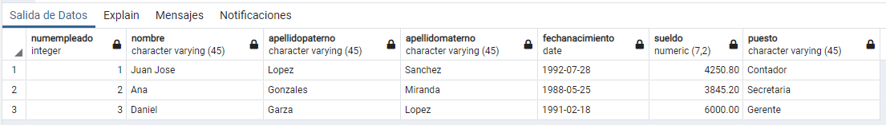
</div>
<br>

y escribimos el siguiente codigo:
```sql
UPDATE empleados
SET nombre = 'Luis Jose'
```
El resultado seria cambiarle el nombre de todos los empleados a "Luis Jose":
<br>
<div align="center"> 
  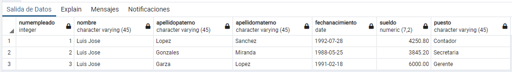
</div>
<br>

**Ejemplo 2**
```sql
UPDATE clientes 
SET idcliente = 1015 
WHERE nombre = 'Daniel' AND apellidopaterno = 'Esparza' AND apellidomaterno = 'Suarez'
```
**Ejemplo 3**
```sql
UPDATE clientes 
SET ciudad = 'Guadalajara' , estado = 'Jalisco'
WHERE idcliente = 1000
```
## Modificar tabla ALTER TABLE

### Renombrar tabla

```sql
ALTER TABLE infoestudiante RENAME TO informacionalumnos
```

### Añadir columna

```sql
ALTER TABLE informacionalumnos ADD COLUMN columnaprueba VARCHAR(45)
```

### Eliminar columna

```sql
ALTER TABLE informacionalumnos DROP COLUMN columnaprueba
```

### Renombrar columna

```sql
ALTER TABLE libros RENAME COLUMN codigo TO codigolibro;
```

### Establecer una columna existente como PRIMARY KEY

```sql
ALTER TABLE informacionalumnos ADD PRIMARY KEY (id_estudiante);
```

### Añadir FOREIGN KEY 
```sql
ALTER TABLE informacionalumnos ADD FOREIGN KEY (id_estudiante) REFERENCES estudiantes(idestudiante);
```
# Consultas

## Consulta basica

## Joins
### INNER JOIN
ejemplos

```sql
SELECT idpedido, clientes.idcliente, nombre
FROM pedidos
INNER JOIN clientes
ON clientes.idcliente=pedidos.idcliente
```
```sql
SELECT *
FROM clientes
INNER JOIN pedidos
ON clientes.idcliente=pedidos.idcliente
```
### LEFT JOIN
la tabla de la izquierda tiene prioridad

**Ejemplo**: usamos el siguiente join para saber cuantas editoriales no tienen libros
si algun valor de codigoeditorial de la tabla 'libros' no encuentra coincidencia en la columna codigo_editorial
de la tabla 'editorial', el join lo rellenará con null
```sql
SELECT * 
FROM editorial
LEFT JOIN libros
ON libros.codigoeditorial = editorial.codigo_editorial
```
# Clausulas
## GROUP BY
Utilizada para clasificar los registros seleccionados en grupos específicos

**Ejemplo 1:** Para saber cuantos tipos de sexo hay en la tabla "persona"
```sql
SELECT sexo
FROM personas
GROUP BY sexo
```
<br>
<div align="center"> 
  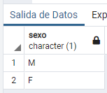
</div>
<br>

**Ejemplo 2:** Para saber cuantas personas por tipo de sexo hay en la tabla "persona"
```sql
SELECT sexo, COUNT (*)
FROM personas
GROUP BY sexo
```
<br>
<div align="center"> 
  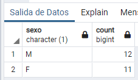
</div>
<br>

**Ejemplo 3:** Para saber cuantas personas por estado, donde el sexo sea 'F', hay en la tabla "persona"
```sql
SELECT estado, COUNT(*)
FROM personas
WHERE sexo = 'F'
GROUP BY estado
```
<br>
<div align="center"> 
  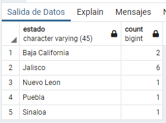
</div>
<br>


## ORDER BY
Utilizada para ordenar los registros seleccionados de acuerdo con un orden específico

**Orden ascendente**
```sql
SELECT *
FROM clientes
ORDER BY idcliente ASC
```
<br>
<div align="center"> 
  
</div>
<br>

**Orden descendente**
```sql
SELECT *
FROM clientes
ORDER BY idcliente DESC
```
<br>
<div align="center"> 
  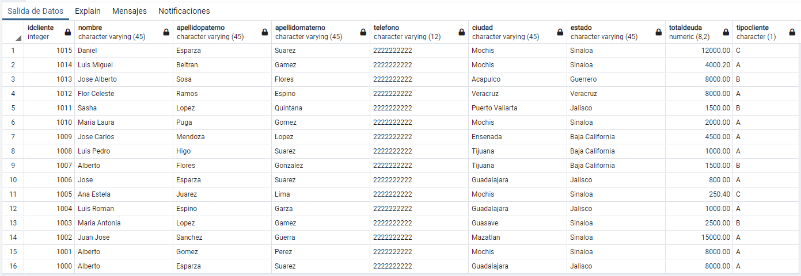
</div>
<br>


## Concatenacion y alias a una columna
```sql
SELECT nombre ||' '|| apellidopaterno ||' '|| apellidomaterno AS Nombrecompleto,carrera,promedio
FROM alumnos
WHERE promedio >= 90
```
<br>
<div align="center"> 
  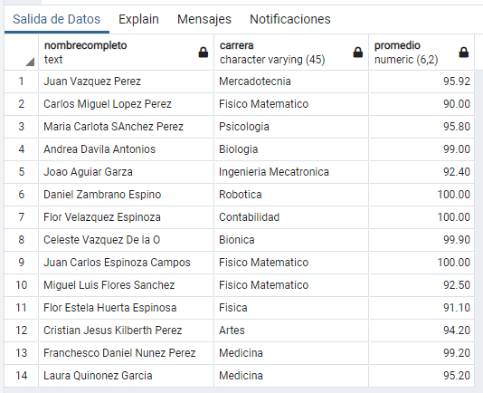
</div>
<br>

## Operadores logicos AND, ORD y NOT

AND: Evalua dos condiciones y devuelve un valor de verdad sólo si ambas son ciertas.

```sql
SELECT nombre ||' '|| apellidopaterno ||' '|| apellidomaterno AS Nombrecompleto,carrera,promedio
FROM alumnos
WHERE promedio >= 90 AND carrera = 'Mercadotecnia'
```

<br>
<div align="center"> 
  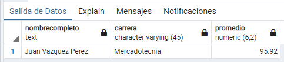
</div>
<br>

OR: Evalúa dos condiciones y devuelve un valor de verdar si alguna de las dos es cierta.

```sql
SELECT nombre ||' '|| apellidopaterno ||' '|| apellidomaterno AS Nombrecompleto,carrera
FROM alumnos
WHERE carrera = 'Contabilidad' OR carrera = 'Ingenieria en Sistemas'
```
<br>
<div align="center"> 
  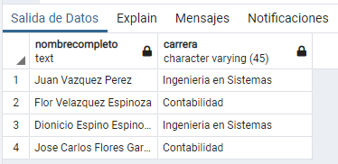
</div>
<br>

NOT: Devuelve el valor contrario de la expresión.

```sql
SELECT nombre ||' '|| apellidopaterno ||' '|| apellidomaterno AS Nombrecompleto,carrera
FROM alumnos
WHERE NOT carrera = 'Ingenieria en Sistemas'
```
<br>
<div align="center"> 
  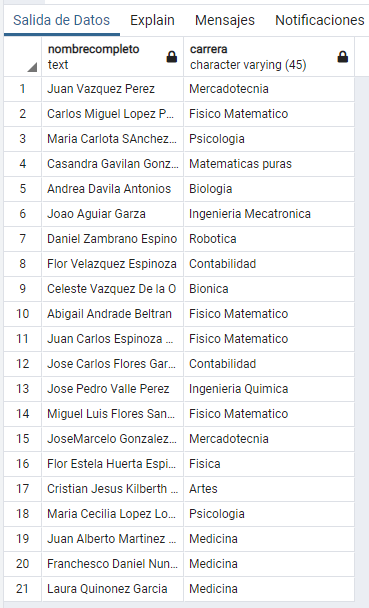
</div>
<br>

# Consultas con predicado
## DISTINCT

```sql
SELECT DISTINCT totaldeuda
FROM clientes
```
<br>
<div align="center"> 
  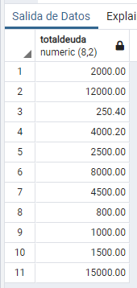
</div>
<br>

Tambien se puede ordenar usando ORDER BY

```sql
SELECT DISTINCT totaldeuda
FROM clientes
ORDER BY totaldeuda DESC

```
<br>
<div align="center"> 
  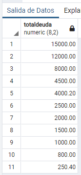
</div>
<br>

